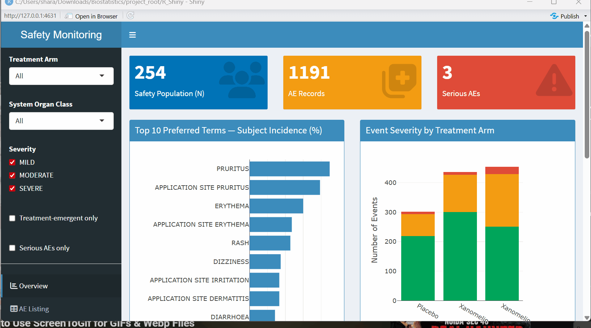

# Safety Monitoring Dashboard (R Shiny + pharmaverseadam)

Interactive clinical safety monitoring dashboard built with R Shiny and pharmaverse ADaM datasets, providing treatment-level AE summaries, SOC/PT analysis, subject-level listings, and longitudinal AE timelines with reactive filtering.

**Live demo:** [Safety Monitoring Dashboard](https://01a112d7-767a-b46d-7573-c2bbb479079d.share.connect.posit.cloud/)

> Hosted on a free tier, so the first load may take a few seconds while the app wakes up. All data is synthetic (`pharmaverseadam`), with no real patient data.



## Features

**Overview**
- Safety population N, total AE records, serious AE count
- Top 10 preferred terms by **subject incidence (%)**, not raw event counts. The denominator is the safety population in the selected arm
- Event severity stacked by treatment arm
- SOC-level summary table: subjects, incidence %, event count

**AE Listing**
- Full filterable/sortable AE listing (`DT` with column filters)

**Subject Profile**
- Per-subject header (arm, age, sex, site) pulled from ADSL
- AE timeline: one horizontal segment per event from `ASTDY` to `AENDY`, coloured by severity, with hover detail
- Per-subject AE listing

**Sidebar filters:** treatment arm, SOC, severity, treatment-emergent only (`TRTEMFL == "Y"`, on by default), serious only (`AESER == "Y"`).

---

## Project structure

```
07_RShiny_Safety_Monitoring_Dashboard/
├── README.md          # This file
├── manifest.json      # Package/R-version manifest used by Posit Connect Cloud
├── Preview.gif        # Animated walkthrough of the dashboard
└── app.R              # Single-file Shiny app
    │
    ├── Data load                  # pharmaverseadam::adsl / ::adae
    ├── pick_col()                 # Resolves ADaM variable names at startup
    ├── adsl_w / adae_w            # Standardised working frames (SAFFL == "Y")
    │
    ├── ui                         # dashboardPage: header, sidebar, body
    │   ├── Sidebar filters        # Arm, SOC, severity, TEAE, serious
    │   ├── Tab: Overview          # Value boxes, PT incidence, severity, SOC table
    │   ├── Tab: AE Listing        # Filterable DT listing
    │   └── Tab: Subject Profile   # ADSL header, AE timeline, per-subject listing
    │
    └── server                     # Reactive logic
        ├── filtered_subjects()    # Incidence denominator (safety population)
        ├── filtered_ae()          # All sidebar filters applied
        ├── plot_pt / plot_sev     # Overview plotly outputs
        ├── soc_table / ae_table   # DT outputs
        └── subj_* outputs         # Subject profile header, timeline, listing
```

**No `data/` directory by design.** ADSL and ADAE are loaded from the `pharmaverseadam` package at runtime, so there is nothing to generate, stage, or version-control. The app is reproducible from a clean checkout.

## Run locally

```r
install.packages(c(
  "shiny", "shinydashboard", "DT", "plotly", "dplyr", "pharmaverseadam"
))

# From the repository root (open the .Rproj in RStudio):
shiny::runApp("07_RShiny_Safety_Monitoring_Dashboard")
```

Or open `app.R` in RStudio and click **Run App**.

## ADaM variables used

| Source | Variables |
|---|---|
| `adsl` | `USUBJID`, `TRT01A` (or `TRT01P`/`ACTARM`/`ARM`), `SAFFL`, `AGE`, `SEX`, `SITEID` |
| `adae` | `USUBJID`, `TRTA`, `AEBODSYS` (or `AESOC`), `AEDECOD`, `AESEV`, `AEREL`, `AESER`, `TRTEMFL`, `ASTDY`, `AENDY` |

Variable names are resolved at startup by `pick_col()`, which tries a list of ADaM-conventional candidates and errors clearly if none are present. This matters because pharmaverseadam's column set has shifted across versions (`AEBODSYS` vs `AESOC`, `TRTA` vs `TRT01A`), and it means the same app runs against a real study's ADAE/ADSL with no code change.

## Analysis conventions

- **Safety population only**: ADSL is filtered to `SAFFL == "Y"`, and ADAE is `semi_join`ed to that set so incidence denominators are correct.
- **Subject incidence, not event counts**, for PT and SOC summaries. `distinct(USUBJID, AEDECOD)` is applied before counting, matching how AE summary tables are presented in a CSR.
- **Treatment-emergent filter defaults on**, as in standard safety reporting.
- Arm assignment for events comes from `TRTA` (actual treatment) rather than planned, consistent with safety analysis convention.

## Swapping in a real study

Replace the two lines at the top:

```r
adsl <- haven::read_sas("path/to/adsl.sas7bdat")
adae <- haven::read_sas("path/to/adae.sas7bdat")
```

Everything downstream is written against resolved variable names, so as long as the datasets are ADaM-conformant it should run unchanged. Keep real study data out of this public repository.

## Deployment

The app is live on **Posit Connect Cloud**, published directly from this GitHub repository.

1. **Generate the manifest.** `rsconnect::writeManifest(appDir = "07_RShiny_Safety_Monitoring_Dashboard")` records the R version and package versions in `manifest.json`. Re-run it and commit the result whenever you add or update a package.
2. **Publish from GitHub.** In Connect Cloud, choose **Publish**, select **Shiny**, then pick this repository, the `main` branch, the `07_RShiny_Safety_Monitoring_Dashboard` folder, and `app.R` as the primary file.

**Continuous integration:** a GitHub Actions job checks that `app.R` and `manifest.json` exist, then starts the app and confirms it responds with HTTP 200 on every push and pull request.

**Other options:** shinyapps.io (Posit has announced it is being retired in favour of Connect Cloud in 2027), Posit Connect for enterprise hosting, or self-hosted Shiny Server for on-premises use.